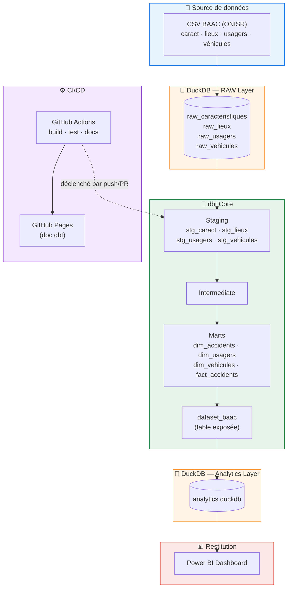

# BAAC Analytics

> Pipeline analytique des accidents corporels de la circulation (données ONISR/BAAC)

[](https://github.com/mustaphaoulhaj/BAAC_Analytics/actions/workflows/dbt_ci.yml)

---

## 📋 Vue d'ensemble

Ce projet construit un pipeline analytique complet à partir des données **BAAC** (Bulletin d'Analyse des Accidents Corporels de la Circulation, source **ONISR**), depuis l'ingestion des fichiers CSV bruts jusqu'à un dashboard **Power BI**, avec un environnement **dbt Core** reproductible et une **CI/CD GitHub Actions**.

## 🏗️ Architecture & technologies



| Brique | Rôle |
|---|---|
| **ONISR / BAAC** | Source des données (4 fichiers CSV par millésime) |
| **DuckDB** | Base analytique fichier, sans credentials cloud, adaptée à la CI |
| **dbt Core** | Transformation SQL (staging → intermediate → marts), tests, documentation |
| **Docker** | Environnement dbt reproductible *(en cours d'intégration)* |
| **GitHub Actions** | CI/CD : build, tests, génération et publication de la doc |
| **GitHub Pages** | Hébergement de la documentation dbt interactive |
| **Power BI** | Restitution finale du dataset agrégé `dataset_baac` |

## 📂 Source de données

**Producteur :** ONISR (Observatoire National Interministériel de la Sécurité Routière)

| Fichier | Contenu |
|---|---|
| `caract-2024.csv` | Caractéristiques de l'accident (date, luminosité, météo, type de collision...) |
| `lieux-2024.csv` | Lieux (catégorie de route, régime de circulation, profil...) |
| `usagers-2024.csv` | Usagers impliqués (gravité, sexe, âge, catégorie...) |
| `vehicules-2024.csv` | Véhicules impliqués (catégorie, manœuvre, obstacle heurté...) |

## 🗂️ Structure du repository

```
BAAC_Analytics/
├── data/                   # CSV sources BAAC (versionnés)
├── models/
│   ├── staging/            # Nettoyage/typage des sources brutes
│   ├── intermediate/       # Logique métier / jointures
│   └── marts/              # Dimensions, faits, dataset exposé
├── tests/
├── macros/
├── snapshots/
├── seeds/
├── analyses/
├── docker/
├── .github/workflows/      # Pipeline CI/CD
├── dbt_project.yml
└── README.md
```

## 📊 Restitution Power BI

Le dataset agrégé `dataset_baac` (couche Analytics DuckDB) alimente un dashboard Power BI.

<!--
  Ajoute tes captures d'écran ici, par exemple :
  
  

  Astuce : crée un dossier docs/images/ dans le repo, dépose tes .png,
  puis référence-les avec le chemin relatif ci-dessus.
-->

*(captures d'écran à venir)*

## ⚙️ CI/CD

À chaque `push` ou `pull request` sur `main`, le workflow [`dbt_ci.yml`](.github/workflows/dbt_ci.yml) :

1. Installe dbt-duckdb et lint le SQL (`sqlfluff`)
2. Exécute `dbt deps`, `dbt seed`, `dbt run`, `dbt test`
3. Génère la documentation (`dbt docs generate`)
4. Publie la documentation sur **GitHub Pages**

## 📓 Journal des décisions

| Date | Décision |
|---|---|
| — | Remplacement de Snowflake par DuckDB pour les couches RAW et Analytics |
| 27/08/2026 | Modèles de staging finalisés ; marts en cours ; démarrage GitHub Actions |
| 28/08/2026 | Dashboard Power BI terminé ; CI/CD GitHub Actions fonctionnelle ; publication de la doc dbt sur GitHub Pages |
